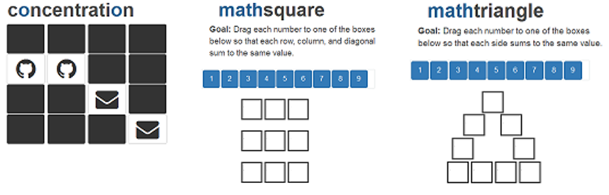

```{r, echo=FALSE}
htmltools::img(src = knitr::image_uri("./images/braingames hex.png"), 
               alt = 'logo', 
               style = 'position:absolute; top:0; right:0; padding:10px; height: 168.75px; width: 150px;')
```

```{r setup, include=FALSE}
library(braingames)
knitr::opts_chunk$set(echo = TRUE)
```

The `braingames` package is a collection of mental challenges in the form of [Shiny](https://shiny.rstudio.com/) apps.

## Motivation

Three main motivators pushed me to create this package.  First, I really wanted to go through the process of making an R package (for the public).  Second, I thought it was about time I contributed **something** to the open source community (a [goal](https://twitter.com/scottyd22/status/947950535042355200) of mine for 2018).  Finally, I really enjoy working with Shiny and thought this would be a fun way to explore new functionality/interactivity.

## Installation

You can install this package from [GitHub](https://github.com/scottyd22/) with:

```{r eval=FALSE}
devtools::install_github('scottyd22/braingames')
```

## Challenges

Three challenges are currently available for the precise moment procrastination strikes.  The first, `concentration`, is a nod to the card game I loved to play as a kid.  The next two, `mathsquare` and `mathtrianlge`, are challenges I presented to students back when I was a math teacher. 



## How to Use

Launching a challenge is as easy as typing its name.  `concentration` is the only challenge that accepts parameters (specify difficulty level 1, 2, or 3) 

```{r echo=TRUE, eval=FALSE}
concentration(2)
mathsquare()
mathtriangle()
```
